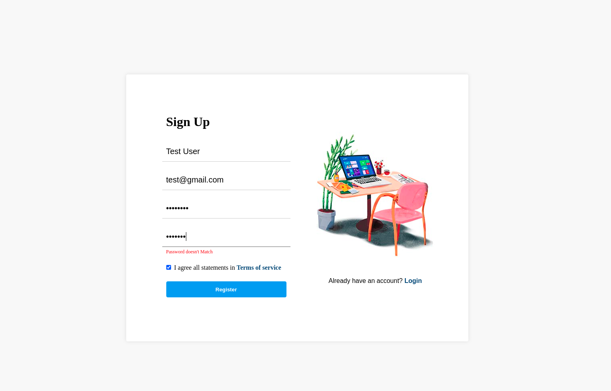
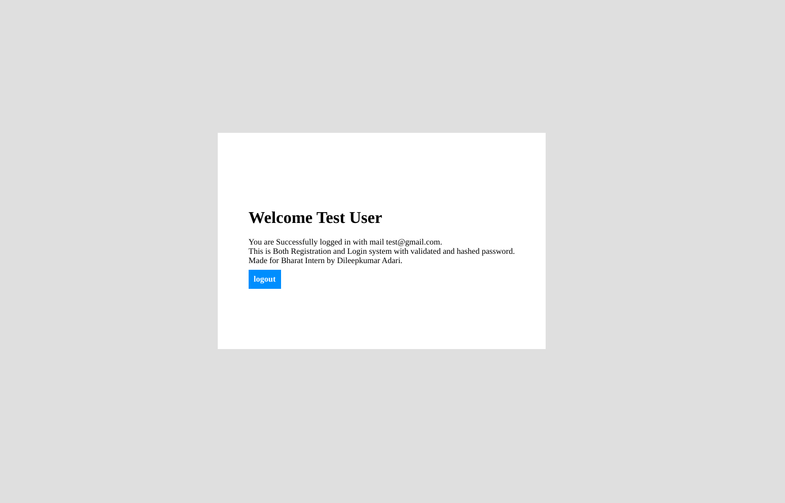

# Authentication-Using-MERN
A login and SignUp system using Node.js in Mongodb, html, css made as a Bharat Virtual Intern in Full Stack Development.

Problem Statement:
Develop a registration form to sign up and store user information using HTML, CSS, Node.js in MongoDB.

# Configuration
Fill the .env.example file with required details and change the name to .env  

# Running the project

In the folder, open terminal and run `npm install` - The required modules gets installed   
Then run the project by running `npm start` on terminal.    
Connect your wifi to something other than university wifi as Mongodb may not be accessible through College wifi.    
The project will run on `localhost:3000` if your port is 3000, open it in chrome for better experience.    

# About the project
This project is a simple login and signup system.   
The project is made using HTML, CSS, Node.js in MongoDB.   
The validation of inputs and server validation was done.  
The user can create a new account and can access their dashboard through login with same credentials.  
The user can also logout from the dashboard.   
The password have being hashed to assure the security of user account.   

# Screenshots
## Signup Page:  
  

## Login Page:   
   

## Home Page:  
   